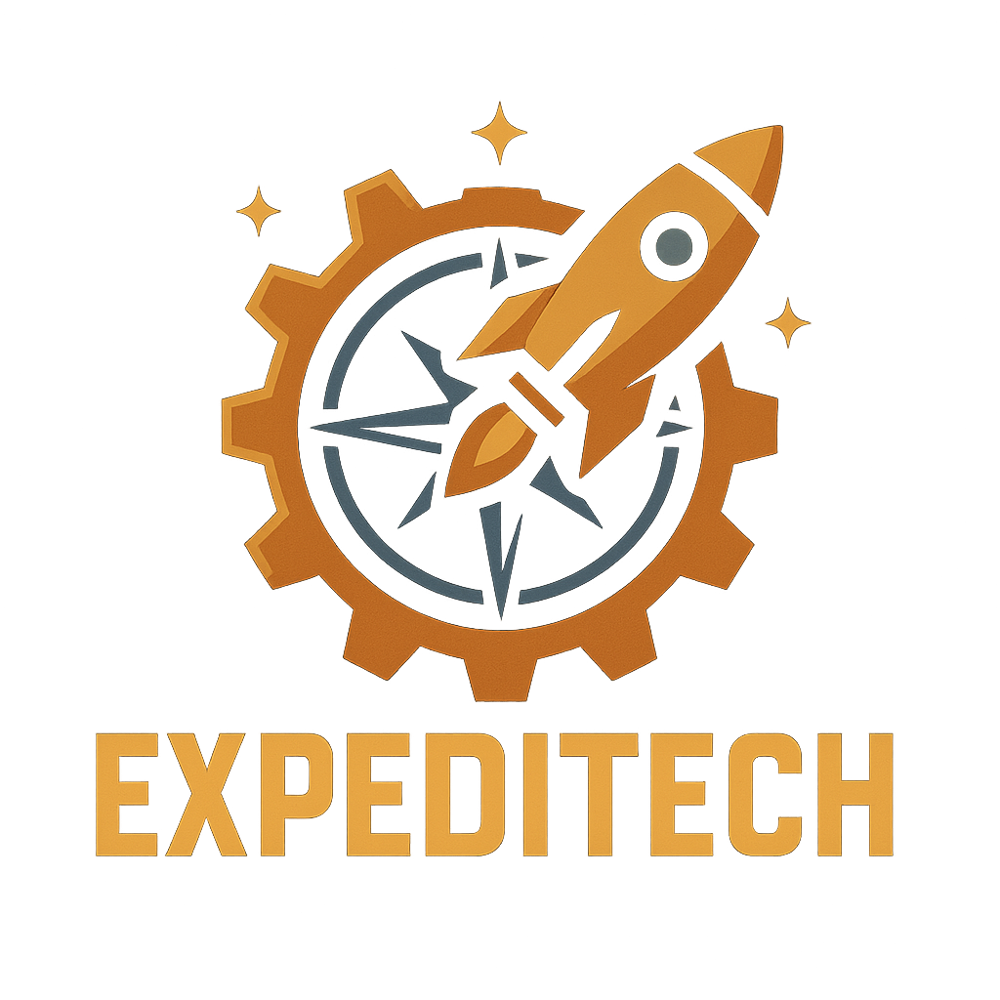

[![Contributors][contributors-shield]][contributors-url]
[![Forks][forks-shield]][forks-url]
[![Stargazers][stars-shield]][stars-url]
[![Issues][issues-shield]][issues-url]
[![MIT License][license-shield]][license-url]

<br />
<div align="center" id="top">
    <a href="https://github.com/caranouga/ExpeditechV2">
        
    </a>
    <h3 align="center">Expeditech</h3>
    <p align="center">
        Expeditech is a Minecraft 1.16.5 mod that adds a variety of new features to the game, including new blocks, items, and gameplay mechanics. It is designed to enhance the Minecraft experience and provide players with new challenges and opportunities for exploration.
        <br />
        It is heavily technology focused, but it also includes some exploration and adventure elements.
        <br />
        <br />
        <a href="https://github.com/Caranouga/ExpeditechV2/issues/new?template=bug_report.yml">Report Bug</a>
        ·
        <a href="https://github.com/Caranouga/ExpeditechV2/issues/new?template=feature_request.yml">Request Feature</a>
    </p>
</div>
<details>
    <summary>Table of Contents</summary>
    <ol>
        <li>
            <a href="#about-the-project">About The Project</a>
        </li>
        <li>
            <a href="#getting-started">Getting Started</a>
            <ul>
                <li><a href="#prerequisites">Prerequisites</a></li>
                <li><a href="#installation">Installation</a></li>
            </ul>
        </li>
        <li><a href="#contributing">Contributing</a></li>
        <li><a href="#license">License</a></li>
        <li><a href="#contact">Contact</a></li>
    </ol>
</details>


## About The Project
<div id="about-the-project"></div>

...

<p align="right">(<a href="#top">back to top</a>)</p>


## Getting Started
<div id="getting-started"></div>

You can download the latest version of Expeditech from the [Releases](https://github.com/caranouga/Expeditech/releases) page or from [CurseForge](https://github.com/Caranouga/Expeditech) (SOON)
<br />
You can also download the latest development version from the [Jenkins][jenkins-url] server.
<br />
<br />
If you want to contribute to the project, you can clone the repository and build the mod yourself.
<br />
To get a local copy up and running follow these simple steps.

### Prerequisites
<div id="prerequisites"></div>

* Windows 10 or later (This project was not tested on other operating systems)

### Installation
<div id="installation"></div>

1. Clone the repo
```sh
git clone https://github.com/caranouga/ExpeditechV2.git
```

2. Generate the run configurations
    - This will generate the necessary run configurations for your IDE.
    - If you are using IntelliJ, you can also use the Gradle tool window to run the tasks.
```sh
.\gradlew.bat genEclipseRuns
```
or
```sh
.\gradlew.bat genIntellijRuns
```

3. Open the project in your IDE
    - If you are using IntelliJ, you can open the project by selecting the `build.gradle` file.
    - If you are using Eclipse, you can import the project as an existing Gradle project.

4. Use the `runClient` or `runServer` Gradle task to run the mod in your IDE.

5. If you want to build the mod, you can use the `build` Gradle task.
    - The built mod will be located in the `build/libs` directory.

<p align="right">(<a href="#top">back to top</a>)</p>


## Contributing
<div id="contributing"></div>

Contributions are what make the open source community such an amazing place to learn, inspire, and create. Any contributions you make are **greatly appreciated**.
If you have a suggestion that would make this better, please fork the repo and create a pull request. You can also simply open an issue with the tag "enhancement".
Don't forget to give the project a star
1. Fork the Project
2. Create your Feature Branch (`git checkout -b feature/AmazingFeature`)
3. Commit your Changes (`git commit -m 'Add some AmazingFeature'`)
4. Push to the Branch (`git push origin feature/AmazingFeature`)
5. Open a <a href="https://github.com/Caranouga/Expeditech/pulls">Pull Request</a>
<p align="right">(<a href="#top">back to top</a>)</p>


## License
<div id="license"></div>

Distributed under the MIT License. See `LICENSE` for more information.
<p align="right">(<a href="#top">back to top</a>)</p>


## Contact
<div id="contact"></div>

Caranouga - malone.payet@caradev.fr
Project Link: [https://github.com/caranouga/ExpeditechV2](https://github.com/caranouga/ExpeditechV2)
<p align="right">(<a href="#top">back to top</a>)</p>


[contributors-shield]: https://img.shields.io/github/contributors/caranouga/ExpeditechV2.svg?style=for-the-badge
[contributors-url]: https://github.com/caranouga/ExpeditechV2/graphs/contributors
[forks-shield]: https://img.shields.io/github/forks/caranouga/ExpeditechV2.svg?style=for-the-badge
[forks-url]: https://github.com/caranouga/ExpeditechV2/network/members
[stars-shield]: https://img.shields.io/github/stars/caranouga/ExpeditechV2.svg?style=for-the-badge
[stars-url]: https://github.com/caranouga/ExpeditechV2/stargazers
[issues-shield]: https://img.shields.io/github/issues/caranouga/ExpeditechV2.svg?style=for-the-badge
[issues-url]: https://github.com/caranouga/ExpeditechV2/issues
[license-shield]: https://img.shields.io/github/license/caranouga/ExpeditechV2.svg?style=for-the-badge
[license-url]: https://github.com/caranouga/ExpeditechV2/blob/master/LICENSE